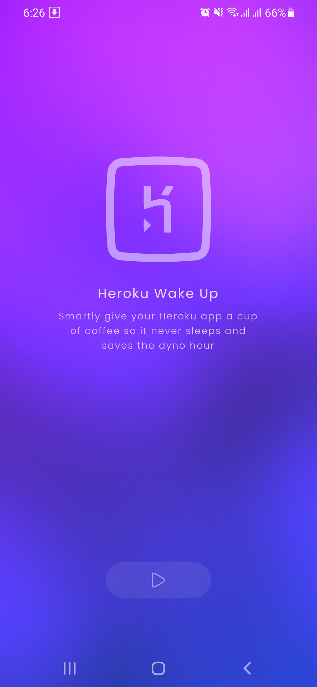
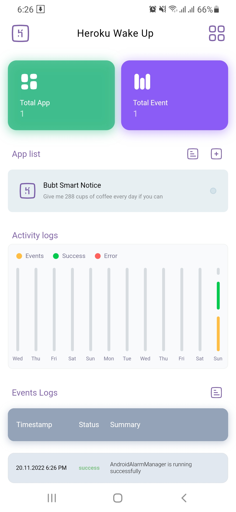
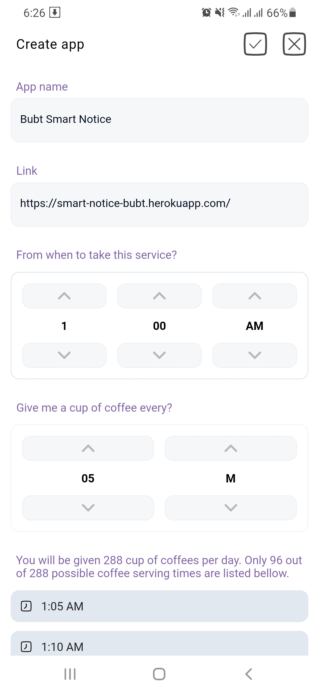

# Heroku Wake up

A foreground service worker app for your personal/ business phone that will wake up "Heroku" App
based on conditions. It may save free dyno hours.

## Problem

Heroku app gives you 500 hours dyno hours of service for free & 1000 dyno hours of service for basic
plan. Which is not enough for a month or production. If you want to keep awake your heroku app you
can use <a href="https://github.com/romainbutteaud/Kaffeine">Kaffeine</a> but the problem is that
your heroku app will not be able able after 15th-21st of each month because they offer you to set 30
minutes interval.

## Solution [Only For Android]

Keeping free Heroku apps awake using <a href="https://github.com/romainbutteaud/Kaffeine">
Kaffeine</a>
Or use Heroku wake up app. You can keep your heroku app awake whenever you want to.

## Screenshots

|           Welcome            |           Dashboard            |         Create/Edit App         |
|:----------------------------:|:------------------------------:|:-------------------------------:|
|  |  |  |

## 📁 Download Now

Get it
from <a href="https://drive.google.com/file/d/1MExiE14_ih3bhYoBh-W8I8R5KvOkJu1Q/view?usp=share_link">
Google drive</a>

## Package used

pubspec.yaml

```
flutter_launcher_icons: ^0.10.0
flutter_native_splash: ^2.2.14
get: ^4.6.5
get_storage: ^2.0.3
uuid: ^3.0.7
dotted_border: ^2.0.0+3
dio: ^4.0.4
webview_flutter: ^3.0.4
font_awesome_flutter: ^10.2.1
intl: ^0.17.0
url_launcher: ^6.1.6
share_plus: ^6.3.0
sizer: ^2.0.15
package_info_plus: ^3.0.2
fluttertoast: ^8.0.9
animate_do: ^3.0.1
flutter_svg: ^1.1.6
hive: ^2.2.3
hive_flutter: ^1.1.0
fl_chart: ^0.55.2
android_alarm_manager_plus: ^2.1.0
path_provider: ^2.0.11
google_fonts: ^3.0.1
simple_animations: ^3.0.0
disable_battery_optimization: ^1.1.0+1
```

## 💻 Installation steps

Clone or download this project in your working directory, Open it using android studio, Sync the
project, build & run the project.

## 🧑 Author

#### Md. Imam Hossain

You can also follow my GitHub Profile to stay updated about my latest projects:

[](https://github.com/imamhossain94)

If you liked the repo then kindly support it by giving it a star ⭐!

Copyright (c) 202 MD. IMAM HOSSAIN